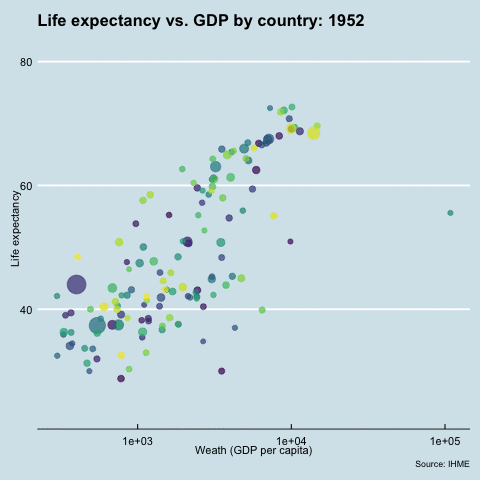
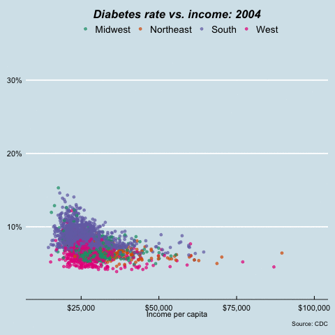
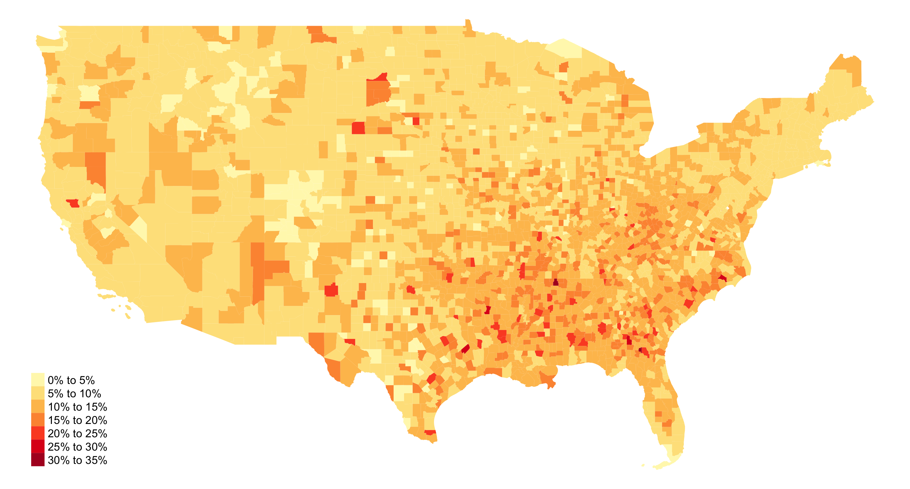
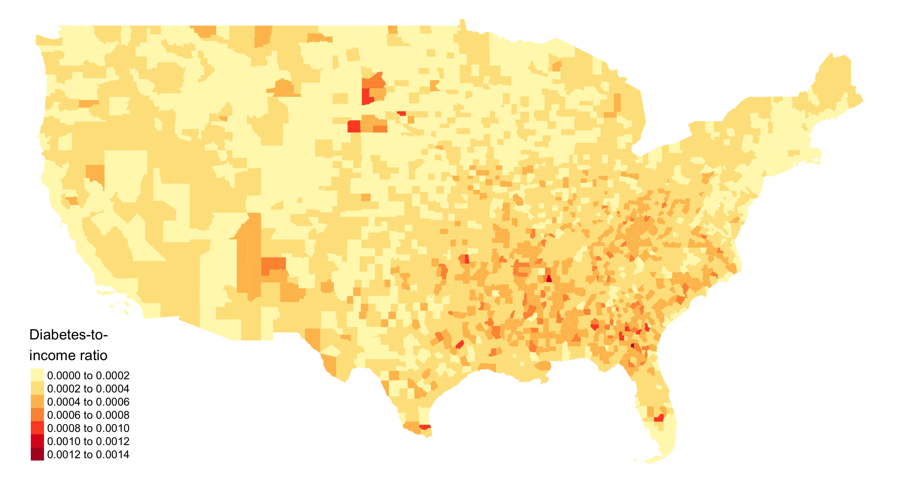
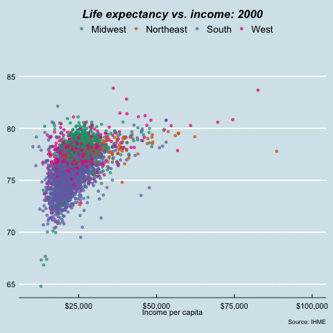
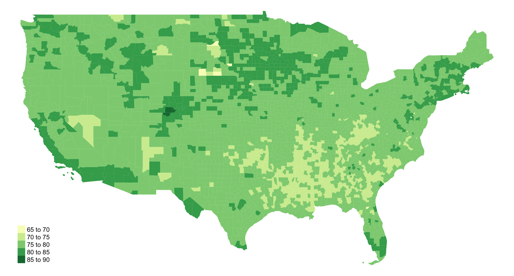
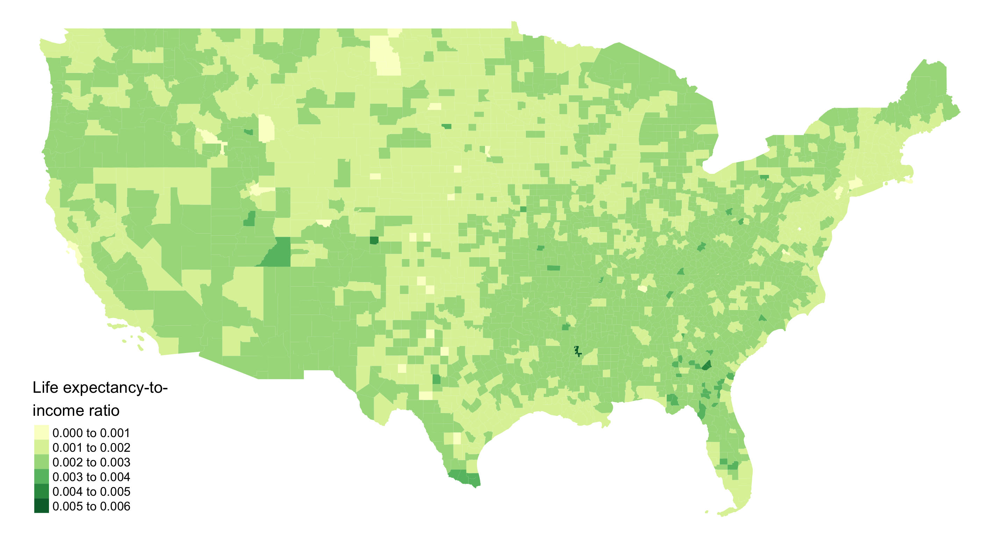
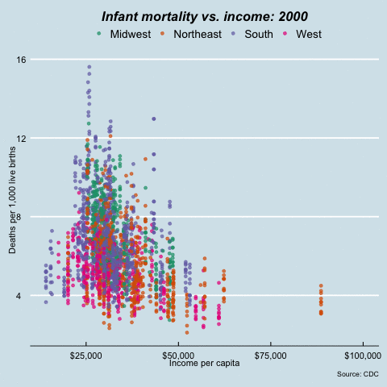

```{r setup, include = FALSE, echo=FALSE}
knitr::opts_chunk$set(echo = TRUE)
#devtools::install_github("dkahle/ggmap")
library(ggmap)
library(httpuv)
register_google(key = Sys.getenv("GOOGLE_MAPS_API_KEY"))
```

# How does wealth relate to health?

In this project, we seek to explore the relationships between income levels and health, as income is frequently brought up as one of the social determinants of health. We will explore this relationship at multiple levels: international, national, and local levels. 

Two main indicators of health are health outcomes, such as life expectancy, and health insurance coverage. The health insurance is especially a big challenge in the United States, given its highly fragmented healthcare system and payment model. In this project, we aim to explore how these measures vary over time and across geography.

## Life expectancy: International, national, state-level

```{r, eval=TRUE, message = FALSE, warning = FALSE, echo=FALSE}
library(ggplot2)
library(plotly)
library(gapminder)
library(tidyr)
library(dplyr)
library(gganimate)
library(ggthemes)
library(ggmap)
library(RColorBrewer)
library(tmap)
library(tidyverse)
library(leaflet)
library(rgeos)
library(lubridate)
library(rgdal)
library(leafsync)
library(acs)
library(stringr)
library(sp)
library(tigris)
#library(shiny)
#library(shinythemes)
library(maptools)
library(magick)
library(scales)
library(readxl)
library(tidytext)
library(readr)
library(DT)
library(ggalt)
library(transformr)
library(viridis)
library(hrbrthemes)
library(gridExtra)
#library(urbnmapr)
library(tidycensus)
library(grid)
library(geosphere)
library(lwgeom)
library(sf)
```

At the international level, we looked at life expectancy as a function of GDP per capita. From 1952 to 2007, life expectancy has increased overall, and we can clearly see that in most countries, as the national wealth increases, the life expectancy also increases.

```{r, eval=FALSE, message=FALSE, warning=FALSE}
p <- ggplot(gapminder, aes(x = gdpPercap, y=lifeExp, size = pop, colour = country)) +
  geom_point(show.legend = FALSE, alpha = 0.7) +
  scale_color_viridis_d() +
  scale_size(range = c(2, 12)) +
  scale_x_log10() +
  theme_economist() +
  labs(x="Weath (GDP per capita)", 
       y="Life expectancy",
       title = "Life Expectancy vs. Income in the world",
       caption = "Source: IHME")

p <- p + transition_time(year) +
  labs(title = "Life expectancy vs. GDP by country: {frame_time}")+
  view_follow(fixed_y = TRUE)
anim_save("life.gif")
```


This pattern continues at the national level in the US: The richest American men live 15 years longer than the poorest men, while the richest American women live 10 years longer than the poorest women.

```{r, eval=TRUE, message=FALSE, warning=FALSE}
df1 <- read.csv("Data/health_ineq_online_table_1.csv")
df1 <- df1 %>% mutate(gnd = ifelse(gnd=="F", "Female", "Male"))

p1 <- ggplot(df1, aes(pctile, le_raceadj),alpha = 1)+
  geom_line(aes(color=gnd))+
  theme_economist() +
  labs(x="\nHousehold income percentile", 
       y="Life expectancy at age 40\n",
       title = "Life expectancy vs. income in the US\n",
       caption = "Source: Health Inequality Project") +
  scale_color_brewer(palette = "Dark2") +
  theme(axis.line = element_line(colour = "black"),
        plot.title = element_text(face = "bold.italic", hjust = 0.5),
        legend.position = "top", legend.title = element_blank())

p1
```

```{r, eval=TRUE, message=FALSE, warning=FALSE}
df3 <- read.csv("Data/health_ineq_online_table_3_female.csv")

df3_2001 <-gather(df3,incomepetile,life,Q1:Q4,factor_key = TRUE)

name <- c("California", "Texas", "Florida", "New York", "Pennsylvania", "Illinois", "Ohio", "Georgia")

df_sub <- df3_2001%>%
  filter(statename %in% name)

p3 <- ggplot(data = df_sub, aes(y = life, x = incomepetile,color = statename, group = statename))+
  geom_line(size = 1)+
  theme_bw()+
  theme_economist() +
  scale_color_brewer(palette = "Dark2") +
  labs(x="\nHousehold income quartile", 
       y="Life expectancy at age 40\n",
       title = "Female life expectancy vs. income\n",
       caption = "Source: Health Inequality Project") +
  theme(axis.line = element_line(colour = "black"),
        plot.title = element_text(face = "bold.italic", hjust = 0.5))+
  theme(legend.position = "right", legend.title = element_blank())

p3
```

```{r, eval=TRUE, message=FALSE, warning=FALSE}
df4 <- read.csv("Data/health_ineq_online_table_3_male.csv")

df4_2001 <-gather(df4,incomepetile,life,Q1:Q4,factor_key = TRUE)

df_sub_2 <- df4_2001%>%
  filter(statename %in% name)

p4 <- ggplot(data = df_sub_2, aes(y = life, x = incomepetile,color = statename, group = statename))+
  geom_line(size = 1)+
  theme_bw()+
  theme_economist() +
  scale_color_brewer(palette = "Dark2") +
  labs(x="\nHousehold income quartile", 
       y="Life expectancy at age 40\n",
       title = "Male life expectancy vs. income\n",
       caption = "Source: Health Inequality Project") +
  theme(axis.line = element_line(colour = "black"),
        plot.title = element_text(face = "bold.italic", hjust = 0.5))+
  theme(legend.position = "right", legend.title = element_blank())

p4
```

# Health outcomes at the local level

```{r, message = FALSE, warning = FALSE, include=FALSE, eval=FALSE}
lower48 <- counties(setdiff(state.name, c("Hawaii", "Alaska")), class = "sf")

lower48$STATECOUNTYFP <- paste0(lower48$STATEFP, lower48$COUNTYFP)

Income <-read_csv("Data/IncomeData.csv")

Income <- Income %>%
  mutate( STATECOUNTYFP = str_pad(`GEOID`, 5, "left", pad = "0"), Year = year)
```

## Diabetes

```{r, message = FALSE, warning = FALSE, eval=FALSE}
Diabetes <- read_csv("Data/DiabetesData.csv")

Diabetes <- Diabetes %>%
	mutate(STATECOUNTYFP = str_pad(`CountyFIPS`, 5, "left", pad = "0"), Percentage = as.numeric(Percentage))

countydiabetes <- merge(lower48, Diabetes, by = "STATECOUNTYFP", duplicateGeoms = TRUE)

countydiabetesincome <- merge(countydiabetes, Income, by = c("STATECOUNTYFP", "Year"), duplicateGeoms = TRUE) %>%
  mutate(year = as.integer(year))

countydiabetesincome$adjustedrate <- countydiabetesincome$Percentage/countydiabetesincome$income_per_capita
```

This plot demonstrates a clear correlation between diabetes rates and income, with higher income counties having lower rates of diabetes. It also shows that while diabetes has increased everywhere over time, the increases have been far more pronounced for poorer counties. Note especially the sharp spike in rates over 2015-2016

```{r, message = FALSE, warning = FALSE, eval=FALSE}
diabetesplot <- ggplot(filter(countydiabetesincome, income_per_capita < 100000), 
                       aes(x = income_per_capita, y = Percentage, color = region_name)) +
  geom_jitter(alpha = .7) +
  theme_economist() +
  scale_color_brewer(palette = "Dark2") +
  labs(x="\nIncome per capita",
       title = "Diabetes rate vs. income\n",
       caption = "Source: CDC") +
  scale_y_continuous(labels = function(x) paste0(x, "%")) +
  scale_x_continuous(labels = dollar) +
  theme(axis.line = element_line(colour = "black"),
        plot.title = element_text(face = "bold.italic", hjust = 0.5), 
        legend.position = "top", legend.title = element_blank(),
        axis.title.y = element_blank())

diabetesplotanim <- diabetesplot + transition_time(year) +
  labs(title = "Diabetes rate vs. income: {frame_time}\n")

diabetesplotanim
```




The first map shows diabetes rates as a percentage of the population for each county in the US. The second maps an adjusted metric, the diabetes ratio/per-capita income ratio. This income-adjusted adjuested ratio is intended to account for variance due to income. Geographic differences in diabetes rates are more muted in the adjusted map, indicating that some of the differences in diabetes levels are actually the result of income clustering. 

```{r, eval = FALSE}
diabetes <- tm_shape(filter(countydiabetes, Year == "2016")) +
  tm_fill(col = "Percentage", title = "", pal = "YlOrRd", n = 5) +
  tm_layout(frame = FALSE, legend.format = list(
    fun = function(x) paste0(formatC(x, digits = 0, format = "f"), "%")))

tmap_save(diabetes, "diabetes_counties_2016_map.png")
```


```{r, eval = FALSE}
diabetes_adjusted <- tm_shape(filter(countydiabetesincome, Year == "2016")) +
  tm_fill(col = "adjustedrate", title = "Diabetes-to-\nincome ratio", pal = "YlOrRd", n = 5) +
  tm_layout(frame = FALSE, legend.format = list(
    fun = function(x) paste0(formatC(x, digits = 4, format = "f"))))

tmap_save(diabetes_adjusted, "diabetes_income_ratio_counties_2016_map.png")
```




## Life expectancy

```{r, message = FALSE, warning = FALSE, eval=FALSE}
LifeExp <- read_csv("Data/ExpectancyData.csv")

LifeExp <- LifeExp %>%
  mutate(clean_lifeexp = as.numeric(str_extract(`Life expectancy`, "^\\d*.\\d*")), 
         STATECOUNTYFP = str_pad(`FIPS`, 5, "left", pad = "0"))

countylife <- merge(lower48, LifeExp, by = "STATECOUNTYFP", duplicateGeoms = TRUE)

countylifeincome <- merge(countylife, Income, by = c("STATECOUNTYFP", "Year"), duplicateGeoms = TRUE) %>%
  mutate(year = as.integer(year))

countylifeincome$adjustedrate <- countylifeincome$clean_lifeexp/countylifeincome$income_per_capita
```

This plot demonstrates a clear relatinoship between life expectancy and income, with higher income counties having higher average life expectancy. There is a worrying pattern of life expectancy increasing for higher-income counties while life expectancy is constant or falling in lower-income counties. 

```{r, eval = FALSE}
lifeplot <- ggplot(filter(countylifeincome, income_per_capita < 100000), 
                   aes(x = income_per_capita, y = clean_lifeexp, color = region_name)) +
  geom_jitter(alpha = .7) +
  theme_economist() +
  scale_color_brewer(palette = "Dark2") +
  labs(x="\nIncome per capita",
       title = "Life expectancy vs. income\n",
       caption = "Source: IHME") +
  scale_x_continuous(labels = dollar) +
  theme(axis.line = element_line(colour = "black"),
        plot.title = element_text(face = "bold.italic", hjust = 0.5), 
        legend.position = "top", legend.title = element_blank(),
        axis.title.y = element_blank())

lifeplotanim <- lifeplot + transition_time(year) +
  labs(title = "Life expectancy vs. income: {frame_time}")

anim_save("lifeplotanim.gif")
```




The first map shows life expectancy for each county in the US. The second maps an adjusted metric, life expectancy/income per capita. Geographic differences in life expectancy (intensity of color variation) are significantly more muted in the adjusted map, indicating that much of the variance in life expectancy is the result of income clustering. 

## Regular map

```{r, eval = FALSE}
life_expectancy <- tm_shape(filter(countylife, Year == "2014")) +
  tm_fill(col = "clean_lifeexp", title = "", pal = "YlGn", n = 5) +
  tm_layout(frame = FALSE, legend.format = list(
    fun = function(x) paste0(formatC(x, digits = 0, format = "f"))))

tmap_save(life_expectancy, "life_expectancy_counties_2014_map.png")
```



```{r, eval = FALSE}
life_expectancy_adjusted <- tm_shape(filter(countylifeincome, Year == "2014")) +
  tm_fill(col = "adjustedrate", title = "Life expectancy-to-\nincome ratio", pal = "YlGn", n = 5) +
  tm_layout(frame = FALSE, legend.format = list(
    fun = function(x) paste0(formatC(x, digits = 3, format = "f"))))

tmap_save(life_expectancy_adjusted, "life_expectancy_adjusted_counties_2014_map.png")
```



## Infant mortality 

```{r, message = FALSE, warning = FALSE, eval=FALSE}
im_data <- read_excel("Data/Linked_Birth_Infant_Death_Records_per_1000_by_County_and_Year_Died_2007-2017.xlsx")

im_data <- im_data %>%
  mutate(STATECOUNTYFP = str_pad(`County Code`, 5, "left", pad = "0"), 
         Deathrate = as.numeric(`Death Rate`))

countyinfant <- merge(lower48, im_data, by = "STATECOUNTYFP", duplicateGeoms = TRUE)

countyinfantincome <- merge(im_data, Income, by = "STATECOUNTYFP", duplicateGeoms = TRUE) %>%
  mutate(year = as.integer(year))

countyinfantincome$adjustedrate <- countyinfantincome$Deathrate/countyinfantincome$income_per_capita
```

Infant mortality shows a clear correlation to income, with higher income counties having lower infant mortality. Neither the pattern nor the overall incidence of child mortality appears to be changing.

```{r, message = FALSE, warning = FALSE, eval=FALSE}
infantplot <- ggplot(filter(countyinfantincome, income_per_capita < 100000), 
                     aes(x = income_per_capita, y = Deathrate, color = region_name)) +
  geom_jitter(alpha = .7) +
  theme_economist() +
  scale_color_brewer(palette = "Dark2") +
  labs(x="\nIncome per capita",
       y = "Deaths per 1,000 live births\n",
       title = "Infant mortality vs. income\n",
       caption = "Source: CDC") +
  scale_x_continuous(labels = dollar) +
  theme(axis.line = element_line(colour = "black"),
        plot.title = element_text(face = "bold.italic", hjust = 0.5), 
        legend.position = "top", legend.title = element_blank())

infantplotanim <- infantplot + transition_time(year) +
  labs(title = "Infant mortality vs. income: {frame_time}")

anim_save("infantplotanim.gif")
```




# Health insurance

In this section, we aim to further our investigation of income and health outcomes by adding in the major player in this linkage -- healthcare insurance. Specifically, we focus on the uninsured population and aim to use visualizations to showcase the influence of income on uninsurance rate. 

Our base data came from the Small Area Health Insurance Estimates (SAHIE) from the Census Bureau, which was extracted from the American Community Survey (ACS) conducted yearly. We narrowed our focus on the period of 2008 to 2018 for data completeness and consistency considerations. We believe the usage of as recent as possible data would be most ideal (for which the latest possible was year 2018), and we aimed to have a long enough period to detect/showcase any trends. We believe 10 years is a good time frame. We also hereby note that the SAHIE only started to utilize the ACS as the basis for its estimates in 2008, prior to which it used the Annual Social and Economic Supplement to the Current Population Survey (CPS ASEC).

Note: The definition of health insurance coverage in the ACS is - "Is this person **CURRENTLY** covered by [specifically stated] health insurance or health coverage plans?"

```{r, message=FALSE, warning=FALSE}
# Loading data

sahie_2008 <- read.csv("Data/sahie_2008_FIPS.csv", header = TRUE)
sahie_2009 <- read.csv("Data/sahie_2009_FIPS.csv", header = TRUE)
sahie_2010 <- read.csv("Data/sahie_2010_FIPS.csv", header = TRUE)
sahie_2011 <- read.csv("Data/sahie_2011_FIPS.csv", header = TRUE)
sahie_2012 <- read.csv("Data/sahie_2012_FIPS.csv", header = TRUE)
sahie_2013 <- read.csv("Data/sahie_2013_FIPS.csv", header = TRUE)
sahie_2014 <- read.csv("Data/sahie_2014_FIPS.csv", header = TRUE)
sahie_2015 <- read.csv("Data/sahie_2015_FIPS.csv", header = TRUE)
sahie_2016 <- read.csv("Data/sahie_2016_FIPS.csv", header = TRUE)
sahie_2017 <- read.csv("Data/sahie_2017_FIPS.csv", header = TRUE)
sahie_2018 <- read.csv("Data/sahie_2018_FIPS.csv", header = TRUE)
```

```{r, message=FALSE, warning=FALSE, echo=FALSE}
# Cleaning data
sahie_2008 <- sahie_2008 %>% 
  select(year,agecat,racecat,sexcat,iprcat,NIPR,NUI,NIC,PCTUI,PCTIC,PCTELIG,PCTLIIC,
         state_name, county_name, fips) %>%
  mutate(NIPR=as.numeric(trimws(gsub("       .","",as.character(NIPR)))),
         NUI=as.numeric(trimws(gsub("       .","",as.character(NUI)))),
         NIC=as.numeric(trimws(gsub("       .","",as.character(NIC)))),
         PCTUI=as.numeric(trimws(gsub("   . ","",as.character(PCTUI)))),
         PCTIC=as.numeric(trimws(gsub("   . ","",as.character(PCTIC)))),
         PCTELIG=as.numeric(trimws(gsub("   . ","",as.character(PCTELIG)))),
         PCTLIIC=as.numeric(trimws(gsub("   . ","",as.character(PCTLIIC)))),
         state_name=trimws(as.character(state_name)),county_name=trimws(as.character(county_name))) %>%
  mutate(fips = ifelse(str_length(fips) < 5, paste0(0, fips), fips))
sahie_2009 <- sahie_2009 %>% 
  select(year,agecat,racecat,sexcat,iprcat,NIPR,NUI,NIC,PCTUI,PCTIC,PCTELIG,PCTLIIC,
         state_name, county_name, fips) %>%
  mutate(NIPR=as.numeric(trimws(gsub("       .","",as.character(NIPR)))),
         NUI=as.numeric(trimws(gsub("       .","",as.character(NUI)))),
         NIC=as.numeric(trimws(gsub("       .","",as.character(NIC)))),
         PCTUI=as.numeric(trimws(gsub("   . ","",as.character(PCTUI)))),
         PCTIC=as.numeric(trimws(gsub("   . ","",as.character(PCTIC)))),
         PCTELIG=as.numeric(trimws(gsub("   . ","",as.character(PCTELIG)))),
         PCTLIIC=as.numeric(trimws(gsub("   . ","",as.character(PCTLIIC)))),
         state_name=trimws(as.character(state_name)),county_name=trimws(as.character(county_name))) %>%
  mutate(fips = ifelse(str_length(fips) < 5, paste0(0, fips), fips))
sahie_2010 <- sahie_2010 %>% 
  select(year,agecat,racecat,sexcat,iprcat,NIPR,NUI,NIC,PCTUI,PCTIC,PCTELIG,PCTLIIC,
         state_name, county_name, fips) %>%
  mutate(NIPR=as.numeric(trimws(gsub("       .","",as.character(NIPR)))),
         NUI=as.numeric(trimws(gsub("       .","",as.character(NUI)))),
         NIC=as.numeric(trimws(gsub("       .","",as.character(NIC)))),
         PCTUI=as.numeric(trimws(gsub("   . ","",as.character(PCTUI)))),
         PCTIC=as.numeric(trimws(gsub("   . ","",as.character(PCTIC)))),
         PCTELIG=as.numeric(trimws(gsub("   . ","",as.character(PCTELIG)))),
         PCTLIIC=as.numeric(trimws(gsub("   . ","",as.character(PCTLIIC)))),
         state_name=trimws(as.character(state_name)),county_name=trimws(as.character(county_name))) %>%
  mutate(fips = ifelse(str_length(fips) < 5, paste0(0, fips), fips))
sahie_2011 <- sahie_2011 %>% 
  select(year,agecat,racecat,sexcat,iprcat,NIPR,NUI,NIC,PCTUI,PCTIC,PCTELIG,PCTLIIC,
         state_name, county_name, fips) %>%
  mutate(NIPR=as.numeric(trimws(gsub("       .","",as.character(NIPR)))),
         NUI=as.numeric(trimws(gsub("       .","",as.character(NUI)))),
         NIC=as.numeric(trimws(gsub("       .","",as.character(NIC)))),
         PCTUI=as.numeric(trimws(gsub("   . ","",as.character(PCTUI)))),
         PCTIC=as.numeric(trimws(gsub("   . ","",as.character(PCTIC)))),
         PCTELIG=as.numeric(trimws(gsub("   . ","",as.character(PCTELIG)))),
         PCTLIIC=as.numeric(trimws(gsub("   . ","",as.character(PCTLIIC)))),
         state_name=trimws(as.character(state_name)),county_name=trimws(as.character(county_name))) %>%
  mutate(fips = ifelse(str_length(fips) < 5, paste0(0, fips), fips))
sahie_2012 <- sahie_2012 %>% 
  select(year,agecat,racecat,sexcat,iprcat,NIPR,NUI,NIC,PCTUI,PCTIC,PCTELIG,PCTLIIC,
         state_name, county_name, fips) %>%
  mutate(NIPR=as.numeric(trimws(gsub("       .","",as.character(NIPR)))),
         NUI=as.numeric(trimws(gsub("       .","",as.character(NUI)))),
         NIC=as.numeric(trimws(gsub("       .","",as.character(NIC)))),
         PCTUI=as.numeric(trimws(gsub("   . ","",as.character(PCTUI)))),
         PCTIC=as.numeric(trimws(gsub("   . ","",as.character(PCTIC)))),
         PCTELIG=as.numeric(trimws(gsub("   . ","",as.character(PCTELIG)))),
         PCTLIIC=as.numeric(trimws(gsub("   . ","",as.character(PCTLIIC)))),
         state_name=trimws(as.character(state_name)),county_name=trimws(as.character(county_name))) %>%
  mutate(fips = ifelse(str_length(fips) < 5, paste0(0, fips), fips))
sahie_2013 <- sahie_2013 %>% 
  select(year,agecat,racecat,sexcat,iprcat,NIPR,NUI,NIC,PCTUI,PCTIC,PCTELIG,PCTLIIC,
         state_name, county_name, fips) %>%
  mutate(NIPR=as.numeric(trimws(gsub("       .","",as.character(NIPR)))),
         NUI=as.numeric(trimws(gsub("       .","",as.character(NUI)))),
         NIC=as.numeric(trimws(gsub("       .","",as.character(NIC)))),
         PCTUI=as.numeric(trimws(gsub("   . ","",as.character(PCTUI)))),
         PCTIC=as.numeric(trimws(gsub("   . ","",as.character(PCTIC)))),
         PCTELIG=as.numeric(trimws(gsub("   . ","",as.character(PCTELIG)))),
         PCTLIIC=as.numeric(trimws(gsub("   . ","",as.character(PCTLIIC)))),
         state_name=trimws(as.character(state_name)),county_name=trimws(as.character(county_name))) %>%
  mutate(fips = ifelse(str_length(fips) < 5, paste0(0, fips), fips))
sahie_2014 <- sahie_2014 %>% 
  select(year,agecat,racecat,sexcat,iprcat,NIPR,NUI,NIC,PCTUI,PCTIC,PCTELIG,PCTLIIC,
         state_name, county_name, fips) %>%
  mutate(NIPR=as.numeric(trimws(gsub("       .","",as.character(NIPR)))),
         NUI=as.numeric(trimws(gsub("       .","",as.character(NUI)))),
         NIC=as.numeric(trimws(gsub("       .","",as.character(NIC)))),
         PCTUI=as.numeric(trimws(gsub("   . ","",as.character(PCTUI)))),
         PCTIC=as.numeric(trimws(gsub("   . ","",as.character(PCTIC)))),
         PCTELIG=as.numeric(trimws(gsub("   . ","",as.character(PCTELIG)))),
         PCTLIIC=as.numeric(trimws(gsub("   . ","",as.character(PCTLIIC)))),
         state_name=trimws(as.character(state_name)),county_name=trimws(as.character(county_name))) %>%
  mutate(fips = ifelse(str_length(fips) < 5, paste0(0, fips), fips))
sahie_2015 <- sahie_2015 %>% 
  select(year,agecat,racecat,sexcat,iprcat,NIPR,NUI,NIC,PCTUI,PCTIC,PCTELIG,PCTLIIC,
         state_name, county_name, fips) %>%
  mutate(NIPR=as.numeric(trimws(gsub("       .","",as.character(NIPR)))),
         NUI=as.numeric(trimws(gsub("       .","",as.character(NUI)))),
         NIC=as.numeric(trimws(gsub("       .","",as.character(NIC)))),
         PCTUI=as.numeric(trimws(gsub("   . ","",as.character(PCTUI)))),
         PCTIC=as.numeric(trimws(gsub("   . ","",as.character(PCTIC)))),
         PCTELIG=as.numeric(trimws(gsub("   . ","",as.character(PCTELIG)))),
         PCTLIIC=as.numeric(trimws(gsub("   . ","",as.character(PCTLIIC)))),
         state_name=trimws(as.character(state_name)),county_name=trimws(as.character(county_name))) %>%
  mutate(fips = ifelse(str_length(fips) < 5, paste0(0, fips), fips))
sahie_2016 <- sahie_2016 %>% 
  select(year,agecat,racecat,sexcat,iprcat,NIPR,NUI,NIC,PCTUI,PCTIC,PCTELIG,PCTLIIC,
         state_name, county_name, fips) %>%
  mutate(NIPR=as.numeric(trimws(gsub("       .","",as.character(NIPR)))),
         NUI=as.numeric(trimws(gsub("       .","",as.character(NUI)))),
         NIC=as.numeric(trimws(gsub("       .","",as.character(NIC)))),
         PCTUI=as.numeric(trimws(gsub("   . ","",as.character(PCTUI)))),
         PCTIC=as.numeric(trimws(gsub("   . ","",as.character(PCTIC)))),
         PCTELIG=as.numeric(trimws(gsub("   . ","",as.character(PCTELIG)))),
         PCTLIIC=as.numeric(trimws(gsub("   . ","",as.character(PCTLIIC)))),
         state_name=trimws(as.character(state_name)),county_name=trimws(as.character(county_name))) %>%
  mutate(fips = ifelse(str_length(fips) < 5, paste0(0, fips), fips))
sahie_2017 <- sahie_2017 %>% 
  select(year,agecat,racecat,sexcat,iprcat,NIPR,NUI,NIC,PCTUI,PCTIC,PCTELIG,PCTLIIC,
         state_name, county_name, fips) %>%
  mutate(NIPR=as.numeric(trimws(gsub("       .","",as.character(NIPR)))),
         NUI=as.numeric(trimws(gsub("       .","",as.character(NUI)))),
         NIC=as.numeric(trimws(gsub("       .","",as.character(NIC)))),
         PCTUI=as.numeric(trimws(gsub("   . ","",as.character(PCTUI)))),
         PCTIC=as.numeric(trimws(gsub("   . ","",as.character(PCTIC)))),
         PCTELIG=as.numeric(trimws(gsub("   . ","",as.character(PCTELIG)))),
         PCTLIIC=as.numeric(trimws(gsub("   . ","",as.character(PCTLIIC)))),
         state_name=trimws(as.character(state_name)),county_name=trimws(as.character(county_name))) %>%
  mutate(fips = ifelse(str_length(fips) < 5, paste0(0, fips), fips))
sahie_2018 <- sahie_2018 %>% 
  select(year,agecat,racecat,sexcat,iprcat,NIPR,NUI,NIC,PCTUI,PCTIC,PCTELIG,PCTLIIC,
         state_name, county_name, fips) %>%
  mutate(NIPR=as.numeric(trimws(gsub("       .","",as.character(NIPR)))),
         NUI=as.numeric(trimws(gsub("       .","",as.character(NUI)))),
         NIC=as.numeric(trimws(gsub("       .","",as.character(NIC)))),
         PCTUI=as.numeric(trimws(gsub("   . ","",as.character(PCTUI)))),
         PCTIC=as.numeric(trimws(gsub("   . ","",as.character(PCTIC)))),
         PCTELIG=as.numeric(trimws(gsub("   . ","",as.character(PCTELIG)))),
         PCTLIIC=as.numeric(trimws(gsub("   . ","",as.character(PCTLIIC)))),
         state_name=trimws(as.character(state_name)),county_name=trimws(as.character(county_name))) %>%
  mutate(fips = ifelse(str_length(fips) < 5, paste0(0, fips), fips))
```

```{r, message=FALSE, warning=FALSE, echo=FALSE}
# Organize by counties

county_2008 <- sahie_2008 %>% filter(agecat==0 & sexcat == 0 & racecat == 0 & iprcat == 0 & county_name != "")
county_2009 <- sahie_2009 %>% filter(agecat==0 & sexcat == 0 & racecat == 0 & iprcat == 0 & county_name != "")
county_2010 <- sahie_2010 %>% filter(agecat==0 & sexcat == 0 & racecat == 0 & iprcat == 0 & county_name != "")
county_2011 <- sahie_2011 %>% filter(agecat==0 & sexcat == 0 & racecat == 0 & iprcat == 0 & county_name != "")
county_2012 <- sahie_2012 %>% filter(agecat==0 & sexcat == 0 & racecat == 0 & iprcat == 0 & county_name != "")
county_2013 <- sahie_2013 %>% filter(agecat==0 & sexcat == 0 & racecat == 0 & iprcat == 0 & county_name != "")
county_2014 <- sahie_2014 %>% filter(agecat==0 & sexcat == 0 & racecat == 0 & iprcat == 0 & county_name != "")
county_2015 <- sahie_2015 %>% filter(agecat==0 & sexcat == 0 & racecat == 0 & iprcat == 0 & county_name != "")
county_2016 <- sahie_2016 %>% filter(agecat==0 & sexcat == 0 & racecat == 0 & iprcat == 0 & county_name != "")
county_2017 <- sahie_2017 %>% filter(agecat==0 & sexcat == 0 & racecat == 0 & iprcat == 0 & county_name != "")
county_2018 <- sahie_2018 %>% filter(agecat==0 & sexcat == 0 & racecat == 0 & iprcat == 0 & county_name != "")
```

```{r, message=FALSE, warning=FALSE, echo=FALSE}
# Organize by states

state_2008 <- sahie_2008 %>% 
  filter(agecat==0 & sexcat == 0 & racecat == 0 & iprcat == 0 & county_name == "") %>% select(-county_name)
state_2009 <- sahie_2009 %>% 
  filter(agecat==0 & sexcat == 0 & racecat == 0 & iprcat == 0 & county_name == "") %>% select(-county_name)
state_2010 <- sahie_2010 %>% 
  filter(agecat==0 & sexcat == 0 & racecat == 0 & iprcat == 0 & county_name == "") %>% select(-county_name)
state_2011 <- sahie_2011 %>% 
  filter(agecat==0 & sexcat == 0 & racecat == 0 & iprcat == 0 & county_name == "") %>% select(-county_name)
state_2012 <- sahie_2012 %>% 
  filter(agecat==0 & sexcat == 0 & racecat == 0 & iprcat == 0 & county_name == "") %>% select(-county_name)
state_2013 <- sahie_2013 %>% 
  filter(agecat==0 & sexcat == 0 & racecat == 0 & iprcat == 0 & county_name == "") %>% select(-county_name)
state_2014 <- sahie_2014 %>% 
  filter(agecat==0 & sexcat == 0 & racecat == 0 & iprcat == 0 & county_name == "") %>% select(-county_name)
state_2015 <- sahie_2015 %>% 
  filter(agecat==0 & sexcat == 0 & racecat == 0 & iprcat == 0 & county_name == "") %>% select(-county_name)
state_2016 <- sahie_2016 %>% 
  filter(agecat==0 & sexcat == 0 & racecat == 0 & iprcat == 0 & county_name == "") %>% select(-county_name)
state_2017 <- sahie_2017 %>% 
  filter(agecat==0 & sexcat == 0 & racecat == 0 & iprcat == 0 & county_name == "") %>% select(-county_name)
state_2018 <- sahie_2018 %>% 
  filter(agecat==0 & sexcat == 0 & racecat == 0 & iprcat == 0 & county_name == "") %>% select(-county_name)
state_0818 <- rbind(state_2008, state_2009, state_2010, state_2011, state_2012, 
                    state_2013, state_2014, state_2015, state_2016, state_2017, state_2018)
```

```{r, message=FALSE, warning=FALSE, echo=FALSE}
p138_state_2008 <- sahie_2008 %>% 
  filter(agecat==0 & sexcat == 0 & racecat == 0 & iprcat == 3 & county_name == "") %>% select(-county_name)
p138_state_2009 <- sahie_2009 %>% 
  filter(agecat==0 & sexcat == 0 & racecat == 0 & iprcat == 3 & county_name == "") %>% select(-county_name)
p138_state_2010 <- sahie_2010 %>% 
  filter(agecat==0 & sexcat == 0 & racecat == 0 & iprcat == 3 & county_name == "") %>% select(-county_name)
p138_state_2011 <- sahie_2011 %>% 
  filter(agecat==0 & sexcat == 0 & racecat == 0 & iprcat == 3 & county_name == "") %>% select(-county_name)
p138_state_2012 <- sahie_2012 %>% 
  filter(agecat==0 & sexcat == 0 & racecat == 0 & iprcat == 3 & county_name == "") %>% select(-county_name)
p138_state_2013 <- sahie_2013 %>% 
  filter(agecat==0 & sexcat == 0 & racecat == 0 & iprcat == 3 & county_name == "") %>% select(-county_name)
p138_state_2014 <- sahie_2014 %>% 
  filter(agecat==0 & sexcat == 0 & racecat == 0 & iprcat == 3 & county_name == "") %>% select(-county_name)
p138_state_2015 <- sahie_2015 %>% 
  filter(agecat==0 & sexcat == 0 & racecat == 0 & iprcat == 3 & county_name == "") %>% select(-county_name)
p138_state_2016 <- sahie_2016 %>% 
  filter(agecat==0 & sexcat == 0 & racecat == 0 & iprcat == 3 & county_name == "") %>% select(-county_name)
p138_state_2017 <- sahie_2017 %>% 
  filter(agecat==0 & sexcat == 0 & racecat == 0 & iprcat == 3 & county_name == "") %>% select(-county_name)
p138_state_2018 <- sahie_2018 %>% 
  filter(agecat==0 & sexcat == 0 & racecat == 0 & iprcat == 3 & county_name == "") %>% select(-county_name)

p250_state_2008 <- sahie_2008 %>% 
  filter(agecat==0 & sexcat == 0 & racecat == 0 & iprcat == 2 & county_name == "") %>% select(-county_name)
p250_state_2009 <- sahie_2009 %>% 
  filter(agecat==0 & sexcat == 0 & racecat == 0 & iprcat == 2 & county_name == "") %>% select(-county_name)
p250_state_2010 <- sahie_2010 %>% 
  filter(agecat==0 & sexcat == 0 & racecat == 0 & iprcat == 2 & county_name == "") %>% select(-county_name)
p250_state_2011 <- sahie_2011 %>% 
  filter(agecat==0 & sexcat == 0 & racecat == 0 & iprcat == 2 & county_name == "") %>% select(-county_name)
p250_state_2012 <- sahie_2012 %>% 
  filter(agecat==0 & sexcat == 0 & racecat == 0 & iprcat == 2 & county_name == "") %>% select(-county_name)
p250_state_2013 <- sahie_2013 %>%
  filter(agecat==0 & sexcat == 0 & racecat == 0 & iprcat == 2 & county_name == "") %>% select(-county_name)
p250_state_2014 <- sahie_2014 %>% 
  filter(agecat==0 & sexcat == 0 & racecat == 0 & iprcat == 2 & county_name == "") %>% select(-county_name)
p250_state_2015 <- sahie_2015 %>% 
  filter(agecat==0 & sexcat == 0 & racecat == 0 & iprcat == 2 & county_name == "") %>% select(-county_name)
p250_state_2016 <- sahie_2016 %>% 
  filter(agecat==0 & sexcat == 0 & racecat == 0 & iprcat == 2 & county_name == "") %>% select(-county_name)
p250_state_2017 <- sahie_2017 %>% 
  filter(agecat==0 & sexcat == 0 & racecat == 0 & iprcat == 2 & county_name == "") %>% select(-county_name)
p250_state_2018 <- sahie_2018 %>% 
  filter(agecat==0 & sexcat == 0 & racecat == 0 & iprcat == 2 & county_name == "") %>% select(-county_name)

p138_state_0818 <- rbind(p138_state_2008, p138_state_2009, p138_state_2010, p138_state_2011, p138_state_2012, 
                    p138_state_2013, p138_state_2014, p138_state_2015, p138_state_2016, p138_state_2017,
                    p138_state_2018)
p250_state_0818 <- rbind(p250_state_2008, p250_state_2009, p250_state_2010, p250_state_2011, p250_state_2012, 
                    p250_state_2013, p250_state_2014, p250_state_2015, p250_state_2016, p250_state_2017,
                    p250_state_2018)
p_state_0818 <- rbind(p138_state_0818, p250_state_0818)
```

```{r, message = FALSE, warning = FALSE, fig.asp = 1, fig.width=10, fig.height=8}
p1 <- p_state_0818 %>% mutate(year=as.factor(year), 
                              iprcat=ifelse(iprcat==2, "At or below 250% FPL", 
                                            "At or below 138% FPL")) %>%
  group_by(year, iprcat) %>% summarise(avg.UI = mean(NUI/NIPR)) %>%
  ggplot(aes(x=year, y=avg.UI, group=iprcat, color=iprcat,
             text = paste('</br> Year: ', year,
                           '</br> Uninsured percentage: ', round(avg.UI,2),
                           '</br> Income level: ', iprcat))) +
  geom_line() +
  geom_point() +
  theme_economist() +
  scale_color_brewer(palette = "Dark2") +
  labs(title="National uninsurance rate by income level\n") +
  ylab("") +
  xlab("") +
  scale_y_continuous(labels = percent_format(accuracy = 1)) +
  theme(axis.line = element_line(colour = "black"),
        plot.title = element_text(face = "bold.italic", hjust = 0.5),
        legend.title = element_blank())

ggplotly(p1, tooltip = "text", height = 400, width=700) %>% 
  config(displayModeBar = FALSE) %>%
  layout(hoverlabel = list(bgcolor = "white", font = list(family = "Georgia")), 
         legend = list(orientation = "h", y=1.08))
```


How are income levels related to the uninsurance rate? We chose to focus on the 138% of the Federal Poverty Level (FPL) and the 250% of FPL. The reasoning is that for the population with income level below the 138% FPL, if their states expanded Medicaid under the Affordable Care Act (ACA, signed into law by President Obama in 2010 and went into effect starting 2014), they may qualify for Medicaid or CHIP. Population that earns an income below the 250% FPL may qualify for out-of-pocket cost assistance on Silver plans sold through the Marketplace. 

From the above graphic, we can see that the lower the income, although with some level of assistance, the higher uninsurance rate across the 10 year period. We can also observe clearly that the uninsurance rate dropped significantly between 2013 and 2014, because of the ACA.

**Hover over data points of interest**

```{r, message=FALSE, warning=FALSE, fig.asp = 1, fig.width=12, fig.height=8}
income <- read.csv("Data/Hongjue_BEA_Income_Per_Capita_by_State_1990-2019.csv")

income <- income %>% mutate(fips = ifelse(str_length(GeoFips) < 5, paste0(0, GeoFips), GeoFips)) %>%
  select(-GeoFips) %>%
  filter(year %in% 2008:2018)

state_simple <- state_0818 %>% select(year, NUI, NIPR, fips)

inc_insur <- left_join(income, state_simple)

p2 <- ggplot(inc_insur, aes(x=NUI/NIPR, y=income_per_capita, color=GeoName, alpha=0.7, shape=as.factor(year),
                            text = paste('</br> Year: ', year,
                                         '</br> State: ', GeoName,
                                         '</br> Uninsured percentage: ', round(NUI/NIPR,2),
                                         '</br> Income level: ', income_per_capita))) +
  geom_point() +
  theme_economist() +
  scale_color_viridis_d() +
  scale_x_continuous(labels = percent_format(accuracy = 1)) +
  scale_y_continuous(labels = dollar) +
  theme(axis.line = element_line(colour = "black"),
        plot.title = element_text(face = "bold.italic", hjust = 0.5),
        legend.position = "none") +
  labs(title = "How does income affect the uninsurance rate?", subtitle = "States by color, years by shape") +
  xlab("Rate of uninsurance") + 
  ylab("Income per capita\n")

ggplotly(p2, tooltip = "text", height = 400, width=780) %>% 
  config(displayModeBar = FALSE) %>%
  layout(hoverlabel = list(bgcolor = "white", font = list(family = "Georgia")))
```


Here is a more detailed look into this income-uninsurance relationship. We can see that, in general, the lower the income per capita (of a certain state in a given year), the higher the state-level uninsured rate. (Note: States are differentiated using color and years are differentiated using shape.)
  
```{r, message=FALSE, warning=FALSE, include=FALSE}
states <- readOGR(dsn = "Data/gz_2010_us_040_00_500k.json")

dt <- inc_insur %>%
  mutate(year=as.factor(year), uninsured = round(NUI/NIPR,2), state = as.character(GeoName)) %>% 
  select(year, state, uninsured, income_per_capita) %>% filter(year==2008)

dt.geo <- dt %>% mutate_geocode(state)
```

To visualize this in a map, we created a Leaflet map with separate layers for the uninsurance rate and income level, shown below for the year 2008. Using this visualization we can observe that in general, the northeast and west coast regions had higher incomes per capita, while the souths, midwest, and Alaska were struggling with the highest uninsurance rate. 


```{r, message=FALSE, warning=FALSE}
dt <- inc_insur %>%
  mutate(uninsured = round(NUI/NIPR,2), state = as.character(GeoName)) %>% 
  select(year, state, uninsured, income_per_capita) %>%
  mutate_geocode(state)
```

```{r, message=FALSE, warning=FALSE, fig.width=6, fig.height=10}
# dt_year <- dt %>% filter(year==2008)
dt_year <- dt %>% group_by(state) %>% 
  summarise(income_per_capita=mean(income_per_capita), uninsured=mean(uninsured), 
            lon=mean(lon), lat=mean(lat)) %>%
  mutate(state=as.factor(state))

states.merged <- merge(x=states, y=dt_year, by.x="NAME", by.y="state")

pal1 <- colorBin("YlOrRd", domain = states.merged$uninsured, bins = c(0, 0.05, 0.1, 0.15, 0.2, 0.25, 0.3))
pal2 <- colorBin("BuGn", domain = states.merged$income_per_capita, bins = c(20000:85000))

popup = paste("State: ", states.merged@data$NAME,
              "<br>Income per capita: ", round(states.merged@data$income_per_capita,2),
              "<br>Uninsured rate: ", round(states.merged@data$uninsured,2))

leaflet(states.merged) %>% addTiles() %>%
  setView(-96, 37.8, 4) %>%
  addPolygons(fillColor = ~pal1(uninsured),
            fillOpacity = 0.6, color = "darkgrey", weight = 1.5,
            popup = popup, group="Uninsured rate")%>%
  addPolygons(fillColor = ~pal2(income_per_capita), 
            fillOpacity = 1, color = "white", weight = 2.0, 
            popup = popup, group="Income level") %>%
  addLayersControl(
    baseGroups = c("Uninsurance rate", "Income level"),
    options = layersControlOptions(collapsed = FALSE))

# height="100%", width="100%"
```

To make it clearer and easier to understand, we created a data table for our users to explore the statistics of their interest:

```{r, eval=TRUE, message=FALSE, warning=FALSE}
dt <- inc_insur %>%
  mutate(year=as.factor(year), uninsured = round(NUI/NIPR,2)) %>% 
  select(year, GeoName, uninsured, income_per_capita) 

colnames(dt) <- c("Year", "State Name", "Uninsurance Rate", "Income per Capita")

dt %>%
  datatable(
    filter = list(position = "top"),
    options = list(language = list(sSearch = "Filter:")))
```
